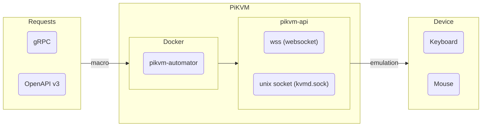

# pikvm-automator

API processor for simple and short macro instruction to automate PiKVM keyboard and mouse emulation.
The easiest way to store and send input commands to PiKVM device.

[](https://hub.docker.com/r/sealbro/pikvm-automator/)



## How to use

Run in container and connect to remote PiKVM device with default credentials:

```shell
docker run -it --rm \
 -v $(pwd):/commands.yml \
 -e PIKVM_ADDRESS=<IP:PORT or HOST> \
 -e PIKVM_SOURCE=wss \
 -e PIKVM_SKIP_TLS_VERIFY=true \
 sealbro/pikvm-automator
```

Run in container on PiKVM device with default credentials:

```shell
docker run -it --rm \
 -v $(pwd):/commands.yml \
 -v /run/kvmd:/run/kvmd \
 -e PIKVM_ADDRESS=/run/kvmd/kvmd.sock \
 -e PIKVM_SOURCE=unix \
 -e PIKVM_SKIP_TLS_VERIFY=true \
 sealbro/pikvm-automator
```

### API integration

- [gRPC](./proto/pikvm_automator.proto)
- [OpenAPI v3](./generated/openapiv3/openapi.yaml)
- [API examples](./endpoints.http)

### Environment variables

| Name                    | Description                | Default         |
|-------------------------|----------------------------|-----------------|
| `PIKVM_ADDRESS`         | PiKVM api address          | required        |
| `PIKVM_SOURCE`          | API source `wss` or `unix` | `wss`           |
| `PIKVM_SKIP_TLS_VERIFY` | Skip TLS verify            | `false`         |
| `PIKVM_USERNAME`        | PiKVM username             | `admin`         |
| `PIKVM_PASSWORD`        | PiKVM password             | `admin`         |
| `COMMANDS_PATH`         | Path with commands file    | `/commands.yml` |
| `TEMPLATE_MAX_DEEP`     | Max recursive replacement  | `10`            |
| `CALL_DEBOUNCE_SECONDS` | Next command cooldown      | `2`             |
| `GRPC_PASSTHROUGH_AUTH` | Passthrough PiKVM auth     | `true`          |
| `GRPC_PROTOCOL`         | gRPC protocol              | `tcp`           |
| `GRPC_ADDRESS`          | gRPC endpoint              | `0.0.0.0:32023` |
| `GRPC_GATEWAY_ADDRESS`  | openapi endpoint           | `0.0.0.0:8032`  |

- `PIKVM_ADDRESS` is required
  - `/run/kvmd/kvmd.sock` for unix socket on device
  - `<IP:PORT or HOST>` for remote connection

## Macro instruction

Example of `commands.yml`:

```yaml
win_d:
  id: win_d
  description: Collapse/Expand all windows
  expression: MetaLeft+KeyD
bios_enable_virtualization:
  id: bios_enable_virtualization
  description: Bios enable virtualization
  expression: '@850''190|@left|700ms|@350''650|@left|700ms|@850''420|@left|300ms|End|50ms|Enter'
bios_save_exit:
  id: bios_save_exit
  description: Bios save configuration and exit
  expression: F10|200ms|@850'770|@left
proxmox_mode:
  id: proxmox_mode
  description: Proxmox bios mode
  expression: 2s|F2|5s|%bios_enable_virtualization%|1s|%bios_save_exit%
```

- `id` - unique identifier
- `description` - description of command
- `expression` - sequence of key presses
  - `F1` - press F1 key ([more keys](./pkg/pikvm/keyboard/key.go))
  - `|` - splitter between commands
  - `+` - press multiple keys at once
    - example `MetaLeft+KeyD` for `Win+D`, hold `MetaLeft` and press `KeyD` and release both
  - `@850'190` - move mouse to x=850, y=190
  - `@left` - press left mouse button
  - `700ms` or `42s` - delay 700ms or 42s
  - `%command_id%` - execute another command, allowed use recursion but not more than `TEMPLATE_MAX_DEEP` times